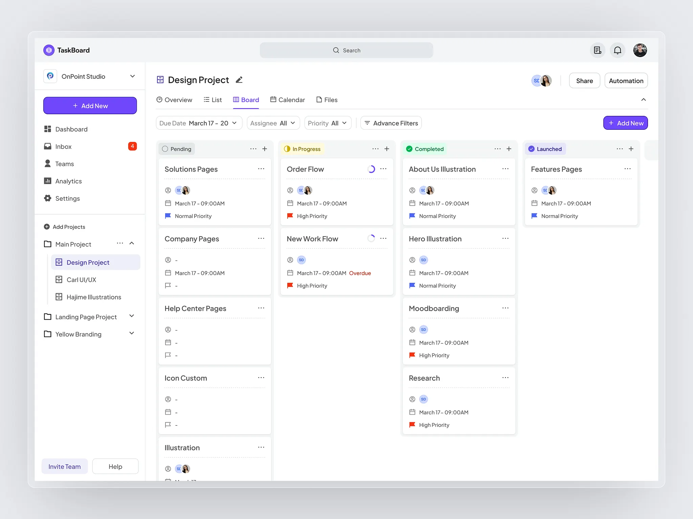

# Fullstack Developer Challenge: TaskBoard – Kanban Project Management

## Overview
This is a timed coding exercise to evaluate your ability to build a fullstack application matching the provided design. Your task is to replicate the **TaskBoard** project management interface shown below.



## Time Limit
**90 minutes** – Prioritize core functionality and visual accuracy.

## Tech Stack
- **Frontend:** Next.js 14+ (App Router) with Tailwind CSS
- **Backend:** Python FastAPI

## Prerequisites

- Python 3.11+
- Node.js 20+
- Docker & Docker Compose (for containerized setup)

## Setup

### Quick Start with Docker Compose

The easiest way to run the entire application:

```bash
# Build and start all services
docker-compose up --build

# Run in detached mode
docker-compose up -d --build

# Stop all services
docker-compose down
```

This will start:
- **Backend API** at http://localhost:8000
- **Frontend** at http://localhost:3000

### Running Manually

#### Frontend
```bash
cd frontend
npm install
npm run dev
```

#### Backend
```bash
cd backend

# Create virtual environment
python -m venv venv
source venv/bin/activate  # On Windows: venv\Scripts\activate

# Install dependencies
pip install -r requirements.txt

# Start the server
uvicorn app.main:app --reload --host 0.0.0.0 --port 8000
```

#### Database Migrations

```bash
cd backend

# Apply all migrations
python migrate.py upgrade

# Revert all migrations
python migrate.py downgrade

# List migration status
python migrate.py list
```

## Required Scope

Build the following sections from `implementation.png`:

### 1. Header
- TaskBoard logo
- Search bar (centered)
- Notification icon, user avatar

### 2. Left Sidebar
- Workspace selector dropdown (OnPoint Studio)
- "+ Add New" button (purple)
- Navigation menu: Dashboard, Inbox (with badge), Teams, Analytics, Settings
- Projects section with expandable tree structure
- "Invite Team" and "Help" buttons at bottom

### 3. Main Content Area
- **Project header:** Title with edit icon, user avatars, Share & Automation buttons
- **View tabs:** Overview, List, Board (active), Calendar, Files
- **Filters bar:** Due Date, Assignee, Priority dropdowns, Advance Filters button, "+ Add New" button

### 4. Kanban Board (Core Feature)
Four columns with status indicators:
- **Pending** (gray)
- **In Progress** (yellow)
- **Completed** (green)
- **Launched** (purple)

Each task card should display:
- Task title
- Assignee avatar(s)
- Due date
- Priority flag (Normal/High)

## API Requirements

Create REST endpoints to support:
- `GET /tasks` – Fetch all tasks
- `POST /tasks` – Create a new task
- `PUT /tasks/{id}` – Update task (including status changes)
- `DELETE /tasks/{id}` – Delete a task

## What NOT to Build
- User authentication
- Mobile/responsive layouts
- Drag-and-drop functionality
- Real-time updates
- Settings, Analytics, or other secondary pages

## Evaluation Criteria

| Category | Weight | Details |
|----------|--------|---------|
| **Visual Accuracy** | 40% | Match colors, typography, spacing, shadows, borders |
| **Functionality** | 30% | CRUD operations work, data persists, UI updates correctly |
| **Code Quality** | 20% | Clean component structure, proper API design, readable code |
| **Layout & Structure** | 10% | Correct use of flex/grid, semantic HTML |

Good luck!
